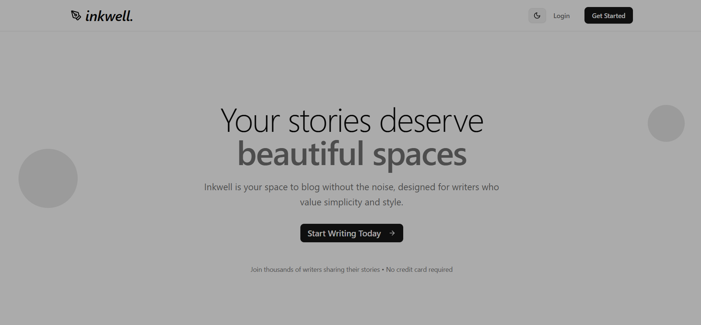
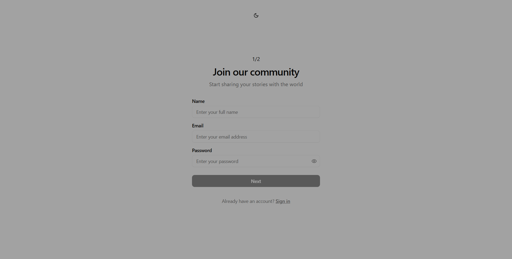
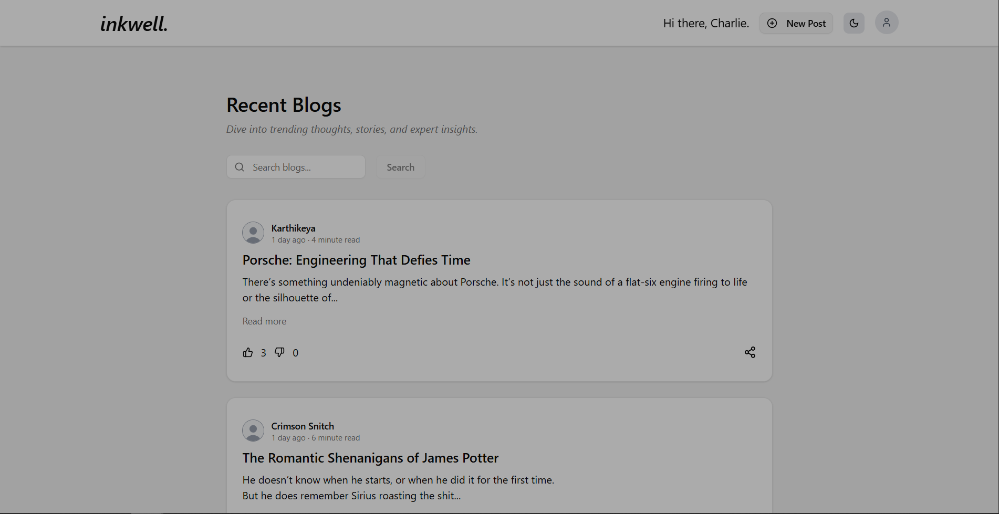
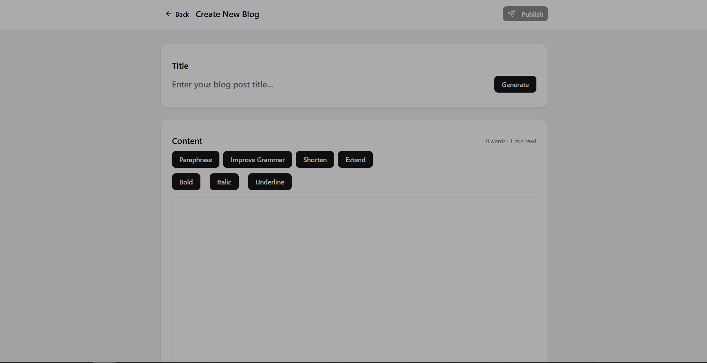
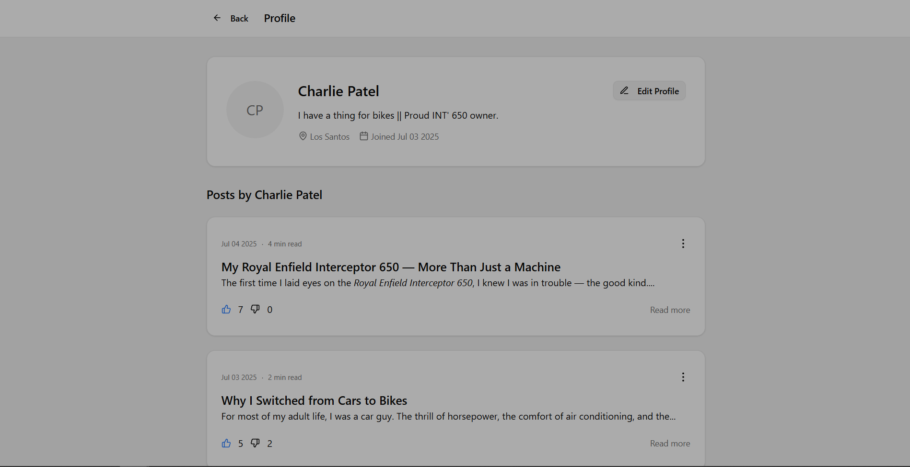
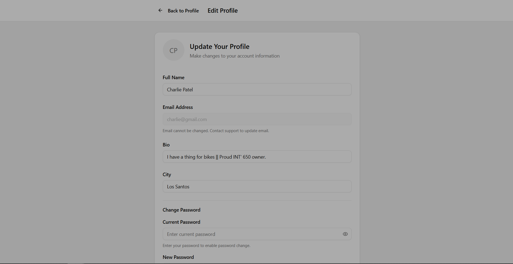
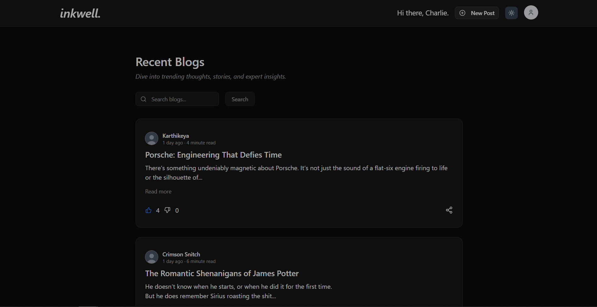

# Inkwell - AI assisted Blogging Platform 

**Inkwell** is a minimalistic AI assisted blogging platform designed for a seamless writing and reading experience. It offers a clean interface, responsive design, and essential features for content publishing, making it ideal for writers who value simplicity and performance.

## Tech Stack

- Frontend: React.js, Typescript, Tailwind CSS, ShadCN, Tiptap

- Backend: Cloudflare Workers, Hono Framework, TypeScript

- Database: PostgreSQL via Prisma ORM

- Authentication: Bcryptjs, JSON Web Tokens (JWT) 

- AI-integration: Google Gemini API

## Features

### Blogging Platform

 - **Publish your own blogs** with formatted text (bold, italic, underline).
 - **Edit and delete** your exisiting blogs.
 - **Read and react** to blogs posted by other writers.
 - Checkout **detailed profiles** of writers on the platform. 
 - View details like **word count** and **estimated read time** for all blogs.
 - **Toggle dark mode** for a comfortable app experience.
 - **Secure authentication** for your account using JWT web tokens.
 - **Hashed passwords** for safe storage using Bcrypt.
 - **Responsive design** for seamless experience on all screen sizes.

### AI-powered writing tools

- **Paraphrasing** — Rewrite selected text while preserving meaning.
- **Grammar Improvements** — Enhance grammar, fluency, and sentence structure.
- **Sentence Shortening** — Compress sentences to keep them short and crisp.
- **Sentence Expansion** — Add details to sentences for richer content.
- **AI-Generated Titles** — Engaging blog title suggestions based on your content.
 

## Running Inkwell locally
Follow these steps to setup and run inkwell locally on your system.

**1. Clone the repository**	
	

    git clone https://github.com/Shree-444/inkwell.git
    cd inkwell

**2. Install dependencies**

For Backend:

    cd backend
    npm install
For Frontend:

    cd ../frontend
    npm install
For Common (shared types):

    cd ../common
    npm install
    

**3. Set Up Environment Variables**

Create `.env` files in both `frontend` and `backend` directories (see next section for details).

**4. Run local development**

Start Backend (Cloudflare Workers Dev):

    cd backend
    npx wrangler dev
Start Frontend (Vite Dev Server):

    cd ../frontend
    npm run dev

The frontend will run on `http://localhost:4000` by default, and your backend API will run on `http://127.0.0.1:8787`.

## Environment Variables
Both frontend and backend require specific environment variables:

**Frontend `.env`**

    VITE_API_URL=http://127.0.0.1:8787/api/v1
For production deployment, replace with your backend URL:

    VITE_API_URL=https://<your-cloudflare-worker-subdomain>.workers.dev/api/v1

**Backend `.env`**

    DATABASE_URL=postgresql://<username>:<password>@<host>:<port>/<database>
    SECRET_KEY=<your-secret-key>
    GEMINI_API_KEY=<your-gemini-api-key>
-   `DATABASE_URL`: PostgreSQL connection string.
    
-   `SECRET_KEY`: Secret used to sign JWT tokens.

 -  `GEMINI_API_KEY`: Active Gemini AI API key from Google AI Studio 

## Screenshots

